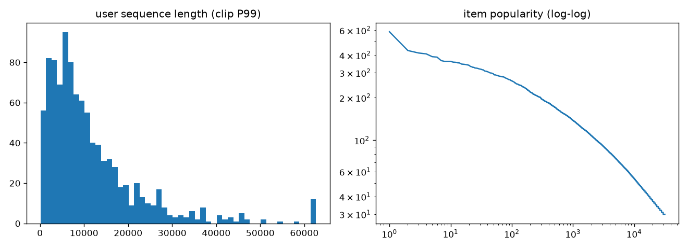

# EDA — KuaiRand-1k

- 交互总数: 11,713,045
- 用户数: 1,000
- 候选 item 数(iid>0): 31,699
- OOV 交互占比: 85.37%
- 日期范围: 20220408 ~ 20220508

## 反馈信号正例率

| 信号 | 正例率 |
|---|---|
| is_click | 0.3782 |
| long_view | 0.2621 |
| is_like | 0.0156 |
| is_follow | 0.0010 |

## 用户序列长度

- P10: 1,998
- P25: 4,370
- P50: 8,327
- P75: 14,990
- P90: 24,418
- P99: 62,626
- 均值: 11,713  最大: 127,557

## 每日交互量

| date | rows |
|---|---|
| 20220408 | 358,009 |
| 20220409 | 400,301 |
| 20220410 | 404,561 |
| 20220411 | 370,216 |
| 20220412 | 345,469 |
| 20220413 | 346,408 |
| 20220414 | 326,469 |
| 20220415 | 361,879 |
| 20220416 | 389,039 |
| 20220417 | 396,844 |
| 20220418 | 333,779 |
| 20220419 | 337,975 |
| 20220420 | 339,479 |
| 20220421 | 345,556 |
| 20220422 | 368,455 |
| 20220423 | 420,805 |
| 20220424 | 349,106 |
| 20220425 | 341,550 |
| 20220426 | 350,481 |
| 20220427 | 349,214 |
| 20220428 | 345,369 |
| 20220429 | 393,536 |
| 20220430 | 438,379 |
| 20220501 | 442,050 ← train_end |
| 20220502 | 426,078 |
| 20220503 | 436,388 |
| 20220504 | 409,114 ← val_end |
| 20220505 | 384,866 |
| 20220506 | 397,627 |
| 20220507 | 389,784 |
| 20220508 | 414,259 |