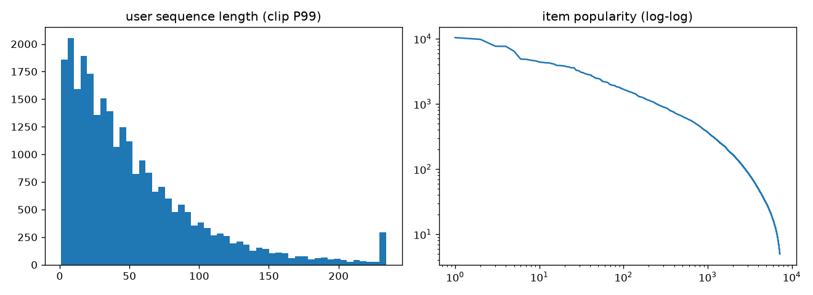

# EDA — KuaiRand-pure

- 交互总数: 1,436,609
- 用户数: 27,077
- 候选 item 数(iid>0): 7,238
- OOV 交互占比: 0.06%
- 日期范围: 20220409 ~ 20220508

## 反馈信号正例率

| 信号 | 正例率 |
|---|---|
| is_click | 0.4597 |
| long_view | 0.3318 |
| is_like | 0.0185 |
| is_follow | 0.0011 |

## 用户序列长度

- P10: 8
- P25: 18
- P50: 39
- P75: 72
- P90: 115
- P99: 234
- 均值: 53  最大: 910

## 每日交互量

| date | rows |
|---|---|
| 20220409 | 52,736 |
| 20220410 | 227,808 |
| 20220411 | 278,835 |
| 20220412 | 166,076 |
| 20220413 | 94,711 |
| 20220414 | 71,252 |
| 20220415 | 58,892 |
| 20220416 | 60,904 |
| 20220417 | 44,023 |
| 20220418 | 24,560 |
| 20220419 | 20,443 |
| 20220420 | 20,851 |
| 20220421 | 20,021 |
| 20220422 | 22,283 |
| 20220423 | 26,645 |
| 20220424 | 18,240 |
| 20220425 | 14,911 |
| 20220426 | 14,530 |
| 20220427 | 14,328 |
| 20220428 | 13,972 |
| 20220429 | 15,839 |
| 20220430 | 21,204 |
| 20220501 | 20,790 ← train_end |
| 20220502 | 19,554 |
| 20220503 | 18,943 |
| 20220504 | 17,600 ← val_end |
| 20220505 | 13,390 |
| 20220506 | 13,834 |
| 20220507 | 13,687 |
| 20220508 | 15,747 |